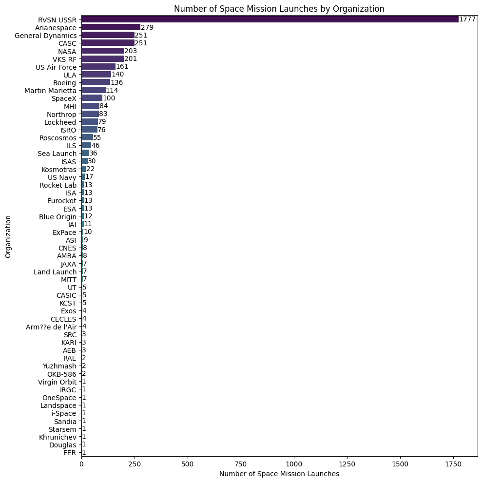
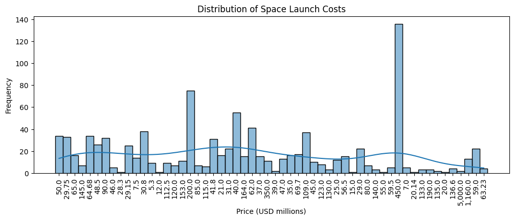
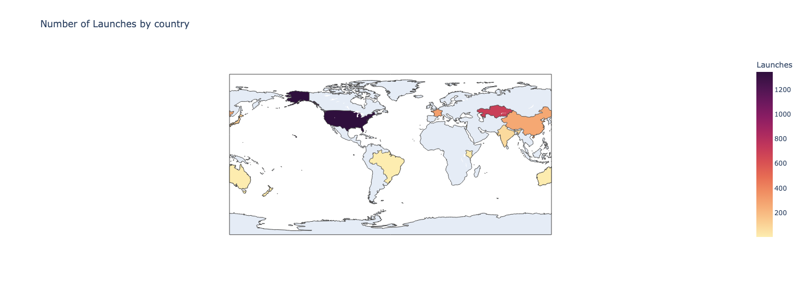
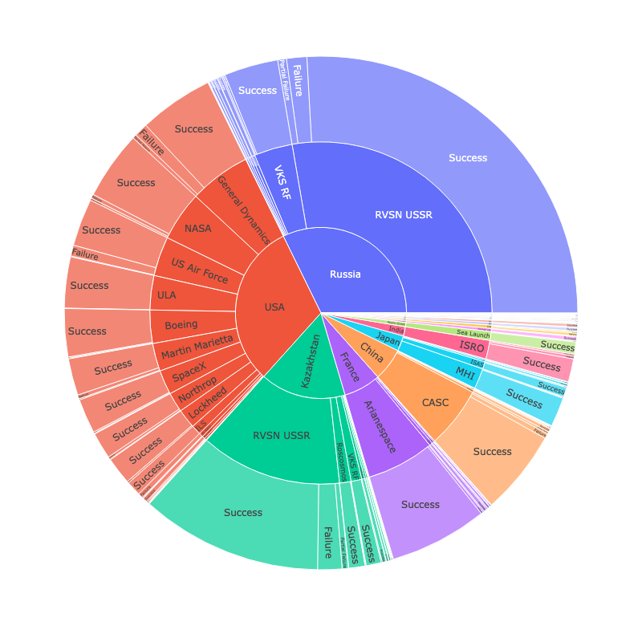
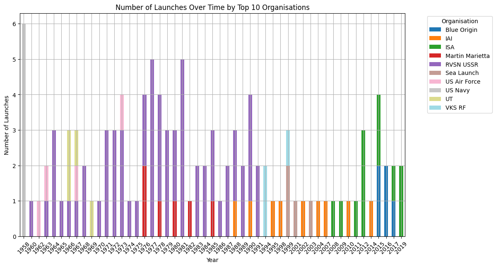

# 🚀 Space Missions Analysis - Data Science Project

## Project Overview

This project explores more than 60 years of global space mission data, covering launches from the beginning of the Space Race in 1957 through modern commercial space exploration.

Using Python and data visualization techniques, the analysis uncovers trends in launch activity, mission success rates, organizational performance, launch costs, and the historical competition between the United States and the Soviet Union.

The project was completed as part of a data analytics and visualization portfolio using real-world space mission data.

## Project Objectives

The primary goals of this analysis were to:

* Clean and prepare historical space mission data
* Explore mission outcomes and launch activity
* Analyze launch costs and spending patterns
* Compare performance across countries and organizations
* Visualize global launch activity geographically
* Investigate Cold War space race trends
* Identify leading organizations over time

## Dataset

The dataset contains historical records of space missions, including:

* Launch date
* Mission status
* Rocket status
* Launch organization
* Launch location
* Country
* Launch cost (USD)
* Mission outcome

The data spans from 1957 through recent years and includes missions from government agencies and private aerospace companies.

## Tools & Technologies

Programming

* Python
* Pandas
* NumPy
* Matplotlib
* ISO3166

## Project Workflow

1. Data Cleaning

* Checked for missing values
* Removed unnecessary columns
* Handled duplicate records
* Converted dates into proper datetime format
* Standardized country information

2. Exploratory Data Analysis

Performed analysis on:

* Number of launches per organization
* Active vs retired rockets
* Mission success and failure rates
* Distribution of launch costs
* Launch frequency over time

3. Geographical Analysis

Created interactive visualizations including:

* Global launch distribution
* Country-level launch activity
* Country-level mission failures
* Geographic launch trends

4. Organization Performance Analysis

Analyzed:

* Total launches by organization
* Spending by organization
* Average launch cost per mission
* Top-performing space agencies and companies

5. Historical Space Race Analysis

Investigated:

* USA vs USSR launch activity
* Launch leadership over time
* Mission failures during the Cold War era
* Evolution of launch dominance

  
## Visualizations

## Key Questions Answered

Launch Activity

* Which organizations launched the most missions?
* How has launch activity changed over time?
* Which months are most popular for launches?

Mission Success

* What percentage of missions were successful?
* Which countries experienced the highest number of failures?

Economics of Space Exploration

* How expensive are space missions?
* Which organizations spent the most on launches?
* How have launch costs evolved over time?

Global Competition

* Which countries dominate space exploration?
* How did the Cold War influence launch activity?
* When did leadership shift between nations?

## Key Insights

* Space launch activity has increased significantly in recent decades.
* Mission success rates have improved substantially over time.
* Government agencies dominated early space exploration, while private companies now play a major role.
* The United States and Soviet Union accounted for the majority of launches during the Cold War era.
* Launch costs vary dramatically between organizations and mission types.
* Commercial spaceflight has accelerated growth in global launch activity.

## Future Enhancements

* Build an interactive Tableau dashboard
* Add predictive modeling for mission success
* Create forecasting models for future launch activity
* Integrate real-time launch data APIs
